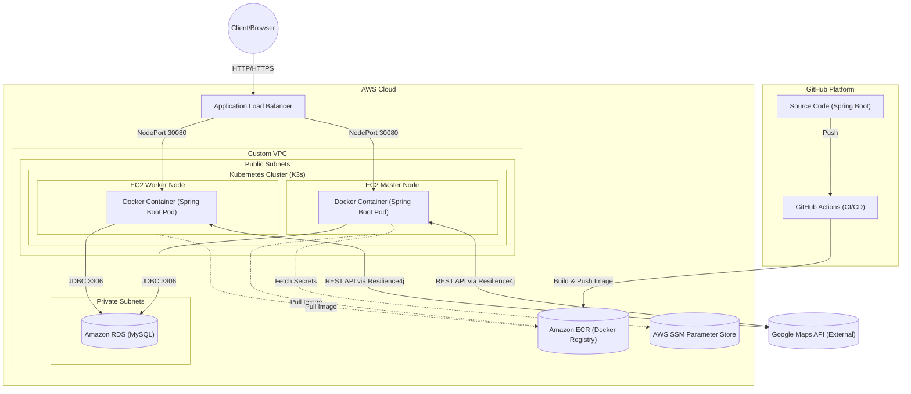
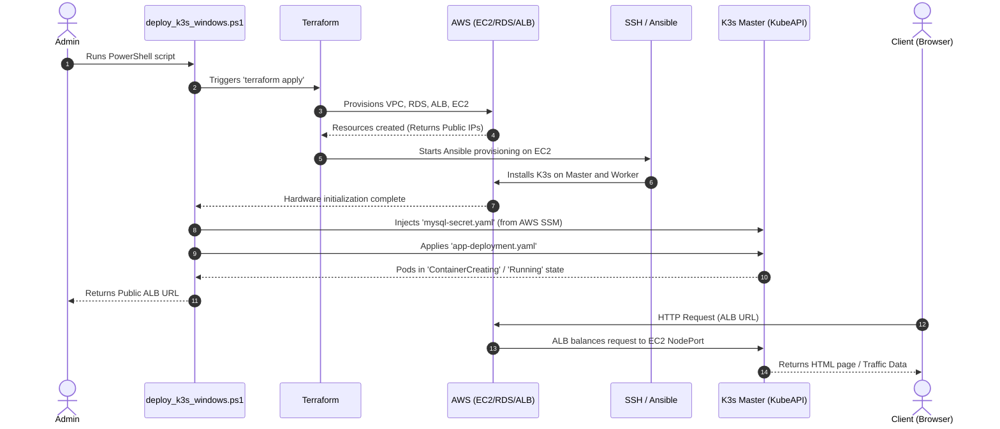

# Report: Cloud Systems and Microservices Development

## 1. Introduction and Project Objectives
The project was developed for the **Cloud Systems** and **Distributed Systems Engineering** courses. Its main objective is the design, containerization, and Cloud deployment of an application based on a **Microservices** architecture.
The application, developed in **Spring Boot**, is designed to collect, analyze, and store traffic and geocoding data by interfacing with external Google Maps APIs.

The project covers the entire DevOps lifecycle (development, containerization, Continuous Integration, and Cloud infrastructure provisioning) strictly divided into two phases:
1. **Local Phase (Phase 1)**: Development and validation on a local Kubernetes cluster.
2. **Cloud Phase (Phase 2)**: Automated infrastructure provisioning (IaC) on Amazon Web Services (AWS) adopting an advanced **IaaS (Infrastructure as a Service)** architecture.

---

## 2. Application Architecture and Implementation Choices

The application follows a classic 3-tier model, modernized for the cloud:
- **Presentation Tier**: RESTful APIs to handle client requests and provide web interfaces (`AnalysisController`, `TrafficWebController`).
- **Business Logic Tier**: Service modules querying Google Maps APIs (`GoogleMapsClient`, `GeocodingService`).
- **Data Tier**: Connection to a relational database (MySQL 8) managed via Spring Data JPA.

### Resilience and Fault-Tolerance
Since this is a distributed system relying on a third-party provider (Google Maps), the **Circuit Breaker** (and Retry) pattern was introduced via the **Resilience4j** library.

In the cloud, the network is unreliable by definition. If Google Maps APIs become unreachable or slow, the Circuit Breaker "trips," temporarily blocking outbound requests. This prevents Tomcat application thread exhaustion and saves the entire backend from collapsing due to infinite timeouts.

### Containerization (Docker)
The application is encapsulated in a container using a **Multi-Stage Dockerfile**.
- *Stage 1 (Build)*: Uses Maven to compile and resolve dependencies in an ephemeral environment.
- *Stage 2 (Runtime)*: Transfers only the compiled `.jar` file into a `distroless` image (bare Java JRE, without a shell or full OS) to reduce image footprint. 
The process is executed under a non-root user (`springuser`).

---

## 3. Cloud Architecture Diagram (AWS)
Below is the logical and physical architecture of the components deployed in the cloud.



*Architectural notes:* 
- The Application Load Balancer (ALB) intercepts internet traffic and distributes it across EC2 nodes (Worker/Master) using Round-Robin on the `NodePort` (30080). 
- EC2 nodes host **K3s**, a lightweight, certified Kubernetes distribution.
- The RDS database resides in a **Private Subnet** (no public IP), accessible only by K3s nodes via strict Security Group rules.
- AWS SSM holds secrets (API Key and Database Password) in encrypted format.

---

## 4. Evolution, Cost Containment, and Phase 2

### IaaS vs PaaS/CaaS Choice
Initially, cloud automation favored managed services like ECS Fargate or Amazon EKS (Elastic Kubernetes Service). However, a purely **IaaS** approach was ultimately chosen: manually installing a Kubernetes cluster (K3s) on unmanaged **EC2** virtual machines.

This decision was driven by the desire to demonstrate full system administration capabilities and granular control over nodes, networks, and orchestration processes. Furthermore, EKS incurs a fixed cost, whereas spot or small EC2 instances allow for drastic **cost containment**.

### Infrastructure-as-Code (IaC) Automation
The entire Cloud infrastructure is written as code using **Terraform**.
No resources were provisioned manually on the AWS console. Terraform creates SSH keys, VPCs, ALBs, the RDS DB, and EC2 instances. Upon hardware creation, Terraform yields dynamic control to **Ansible**, which connects via SSH to the newly spun nodes, installs the K3s cluster, and joins the Worker to the Master.

---

## 5. Execution Flow Diagram

The following diagram illustrates the automated lifecycle triggered from local automation to the Client response.



---

## 6. Documentation

### Phase 1 Execution (Local)
Requires Docker Desktop (Kubernetes enabled).
1. **Compilation**: `docker build -t maps-app:latest ./server-springboot-maps`
2. **K8s Deploy**: `kubectl apply -f infrastructure/k8s/`
3. **Access**: `http://localhost:30080`
4. **Teardown**: `kubectl delete -f infrastructure/k8s/`

### Phase 2 Execution (AWS Cloud)
Requires locally configured AWS keys (`aws configure`).
Deployment uses a custom **Global Automation PowerShell Script** designed to merge remote Terraform and Kubectl steps.

1. **Full Deployment**:
   ```powershell
   cd infrastructure
   .\deploy_k3s_windows.ps1
   ```
   *The script (approx. 10 minutes runtime) handles physical infrastructure creation on AWS, Kubernetes installation, and software deployment, ultimately returning the web endpoint.*
   *(Operational note: to ensure native Windows compatibility without relying on WSL, the PowerShell script adopts a purely agent-less approach via raw SSH to configure nodes, bypassing Ansible).*

   - Terraform: Manages physical infrastructure (VPC, EC2, ALB, RDS)
   - SSH (Agent-less): Installs K3s and configures nodes by dynamically extracting join tokens
   - Kubernetes: Orchestrates containers (Deployment, Service, Ingress)
   - AWS SSM: Manages secrets (API Key, Password)
    
    Without the script, manual execution would require dozens of complex commands and manual interaction between Terraform, AWS CLI, Ansible, and Kubectl.

2. **Destruction (Cost Saving)**: 
   To avoid unwanted charges at project completion:
   ```bash
   cd infrastructure/aws-terraform
   terraform destroy -auto-approve -var="db_password=PASS" -var="google_api_key=KEY"
   ```

---

## 7. File Hierarchy (Tree) and Project Structure

The project is modular and divided by responsibility:

```text
ServerApiMaps/
│
├── .github/workflows/         # CI/CD Pipeline: Actions for auto-build and ECR push
│   └── deploy.yml
│
├── docs/                      # Project documentation
│   └── report.md              
│
├── infrastructure/            # DevOps automation code (Phase 1 & 2)
│   ├── aws-terraform/         # HCL IaC templates to create machines, network, and DB on AWS
│   │   ├── main.tf
│   │   ├── ec2.tf
│   │   └── variables.tf
│   ├── k8s/                   # Kubernetes YAML manifests for app deployment
│   │   ├── app-deployment.yaml
│   │   ├── mysql-deployment.yaml
│   │   └── rbac.yaml
│   ├── ansible/               # Configuration playbooks (K3s installation on spawned nodes)
│   └── deploy_k3s_windows.ps1 # PowerShell script orchestrating the entire cloud setup 
│
├── server-springboot-maps/    # Source Code (Java Spring Boot)
│   ├── src/main/java/...      # Classes, Controllers, Services, and RabbitMQ/Resilience4j configs
│   ├── src/main/resources/    # application.properties and HTML Templates (Thymeleaf)
│   ├── pom.xml                # Maven dependencies
│   └── Dockerfile             # Multi-stage instructions for secure containerization
│
├── .gitignore                 # Prevents committing TFState and Secrets (mysql-secret.yaml)
└── README.md                  
```

---

## 8. Troubleshooting and Solved Technical Challenges

During the migration from local to Cloud environments, complex architectural issues emerged, which were solved using an analytical and DevOps approach:

1. **Server Collapse due to OOM (Out of Memory)**
   The EC2 Master node in AWS (free-tier `t3.micro` instance) systematically froze during Java app deployment. The SSH connection timed out.
   Monitoring metrics revealed physical memory exhaustion (t3.micro only has 1 GB of RAM), causing heavy Memory Swapping (Thrashing) to meet minimum K3s cluster requirements combined with the Spring Boot container. The issue was resolved with a temporary but essential *Vertical Scale-Up* to a `t3.small` instance (2 GB of RAM).

2. **Health-Check False Positive (502 Bad Gateway on ALB)**
   The Application Load Balancer showed nodes as "Unhealthy" and returned 502 Bad Gateways to clients, even though the app was running inside the containers.
   Inspecting Kubernetes Pod logs and the Spring Boot `/actuator/health` endpoint revealed the application was reporting a "DOWN" status. The root cause was the Actuator defaulting to establish a connection with the RabbitMQ broker. In the Cloud, this broker was intentionally not deployed. Instead of modifying source code or rebuilding the container, Kubernetes flexibility was leveraged by injecting the `MANAGEMENT_HEALTH_RABBIT_ENABLED=false` environment variable at runtime directly into `app-deployment.yaml`. This dynamically disabled the RabbitMQ check, restoring the app status to "UP" and unblocking ALB traffic.
