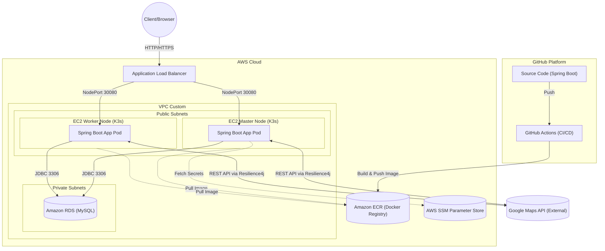
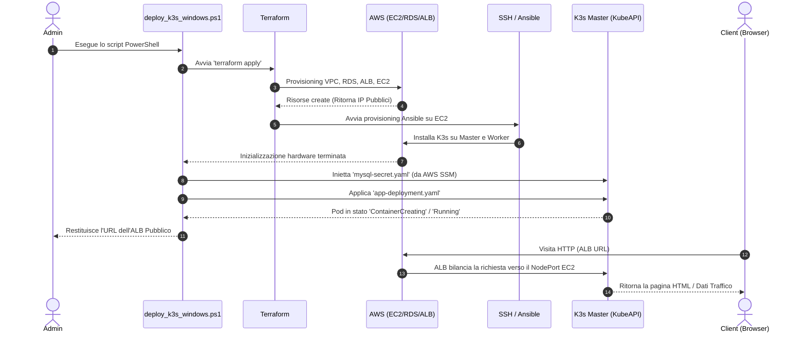

# Relazione: Sistemi Cloud e Sviluppo a Microservizi

## 1. Introduzione e Obiettivi del Progetto
Il progetto è stato sviluppato per il corso di **Sistemi Cloud**. L'obiettivo principale è la progettazione, containerizzazione e distribuzione in ambiente Cloud di un'applicazione basata sull'architettura a **Microservizi**.
L'applicazione, sviluppata in **Spring Boot**, ha il compito di raccogliere, analizzare e memorizzare dati sul traffico e geocoding, interfacciandosi con le API esterne di Google Maps.

Il progetto copre l'intero ciclo di vita DevOps (sviluppo, containerizzazione, Continuous Integration e provisioning dell'infrastruttura Cloud) diviso rigorosamente in due fasi:
1. **Fase Locale (Fase 1)**: Sviluppo e validazione su cluster Kubernetes in locale.
2. **Fase Cloud (Fase 2)**: Provisioning automatizzato dell'infrastruttura (IaC) su Amazon Web Services (AWS) e adozione di un'architettura **IaaS (Infrastructure as a Service)** avanzata.

---

## 2. Architettura dell'Applicazione e Scelte Implementative

L'applicazione segue un classico modello a 3-tier, modernizzato per il cloud:
- **Presentation Tier**: API RESTful per gestire le richieste client e fornire interfacce web (`AnalysisController`, `TrafficWebController`).
- **Business Logic Tier**: Moduli di servizio che interrogano le API di Google Maps (`GoogleMapsClient`, `GeocodingService`).
- **Data Tier**: Connessione a un database relazionale (MySQL 8) gestita con Spring Data JPA.

### Resilience e Fault-Tolerance
Trattandosi di un sistema distribuito che dipende da un fornitore terzo (Google Maps), è stato introdotto il pattern **Circuit Breaker** (e Retry) tramite la libreria **Resilience4j**.

In cloud, la rete è inaffidabile per definizione. Se le API di Google Maps dovessero risultare irraggiungibili o molto lente, il Circuit Breaker "scatta", bloccando temporaneamente le richieste in uscita. Questo previene l'esaurimento dei thread dell'applicazione Tomcat e salva l'intero backend dal collasso in attesa di timeout infiniti.

### Containerizzazione (Docker)
L'applicazione è incapsulata in un contenitore tramite un **Dockerfile Multi-Stage**.
- *Stage 1 (Build)*: Sfrutta Maven per compilare e risolvere le dipendenze in un ambiente effimero.
- *Stage 2 (Runtime)*: Trasferisce solo il file `.jar` compilato all'interno di un'immagine `distroless` (Java JRE nuda, senza shell o OS completo) per ridurre il peso dell'immagine. 
Il processo è avviato tramite un utente non-root (`springuser`).

---

## 3. Schema dell'Architettura Cloud (AWS)
Di seguito l'architettura logica e fisica dei componenti deployati in cloud.





*Note architetturali:* 
- L'Application Load Balancer (ALB) intercetta il traffico da internet e lo distribuisce sui nodi EC2 (Worker/Master) in Round-Robin sulla `NodePort` (30080). 
- I nodi EC2 ospitano **K3s**, una versione leggera e certificata di Kubernetes.
- Il database RDS risiede in una **Private Subnet** (senza IP pubblico), accessibile solo dai nodi K3s tramite le regole rigorose dei Security Group.
- AWS SSM contiene i secret (API Key e Password Database) in formato cifrato.

---

## 4. Evoluzione, Contenimento dei Costi e Fase 2

### Scelta IaaS vs PaaS/CaaS
Inizialmente, l'automazione in Cloud orientava verso l'utilizzo di ECS Fargate o Amazon EKS (Elastic Kubernetes Service). Tuttavia, è stata effettuata una scelta verso un approccio puramente **IaaS**: installare manualmente un cluster Kubernetes (K3s) su macchine virtuali **EC2** non gestite.

La scelta è stata dettata dalla volontà di dimostrare piena capacità di amministrazione sistemistica e controllo granulare sui nodi, sulle reti e sui processi di orchestrazione. Inoltre, EKS prevede un costo fisso, mentre macchine EC2 spot o di piccola taglia permettono un drastico **contenimento dei costi**.

### L'Automazione Infrastructure-as-Code (IaC)
L'intera infrastruttura Cloud è scritta come codice tramite **Terraform**.
Nessuna risorsa è stata cliccata a mano sulla console AWS. Terraform provvede a creare le chiavi SSH, la VPC, l'ALB, il DB RDS e le EC2. Al termine della creazione hardware, Terraform cede il controllo dinamico ad **Ansible**, che si collega in SSH ai nodi appena nati e installa il cluster K3s, collegando il Worker al Master.

---

## 5. Diagramma di Flusso dell'Esecuzione

Il seguente diagramma mostra il ciclo di vita automatizzato che scaturisce quando eseguiamo l'automazione locale fino alla risposta al Client.



---

## 6. Documentazione

### Esecuzione della Fase 1 (Locale)
Necessita di Docker Desktop (Kubernetes attivato).
1. **Compilazione**: `docker build -t maps-app:latest ./server-springboot-maps`
2. **Deploy K8s**: `kubectl apply -f infrastructure/k8s/`
3. **Visita**: `http://localhost:30080`
4. **Smantellamento**: `kubectl delete -f infrastructure/k8s/`

### Esecuzione della Fase 2 (Cloud AWS)
Necessita di chiavi AWS configurate in locale (`aws configure`).
Il deploy avviene tramite uno **Script PowerShell di Automazione Globale** creato ad hoc per fondere i passaggi di Terraform e Kubectl in remoto.

1. **Deploy Totale**:
   ```powershell
   cd infrastructure
   .\deploy_k3s_windows.ps1
   ```
   *Lo script (circa 10 minuti di esecuzione) si occupa di creare l'infrastruttura hardware su AWS, installare Kubernetes e fare il deploy del software, restituendo infine l'endpoint web.*

   - Terraform: Gestisce l'infrastruttura fisica (VPC, EC2, ALB, RDS)
   - Ansible: Installa K3s e configura i nodi
   - Kubernetes: Orchesta i container (Deployment, Service, Ingress)
   - AWS SSM: Gestisce i secret (API Key, Password)
    
    Senza lo script, l'esecuzione manuale richiederebbe decine di comandi complessi e l'interazione manuale tra Terraform, AWS CLI, Ansible e Kubectl. I comandi da eseguire manualmente sarebbero:
    
    ```bash
    # 1. Provisioning infrastruttura AWS
    cd infrastructure/aws-terraform
    terraform init
    terraform apply -var="db_password=PASS" -var="google_api_key=KEY"
    
    # 2. Recupero IP pubblici delle macchine EC2 create
    MASTER_IP=$(terraform output -raw k3s_master_public_ip)
    
    # 3. Provisioning del Software sui Nodi tramite Ansible
    cd ../ansible
    # Inserimento manuale degli IP nel file hosts (inventory)
    ansible-playbook -i inventory/hosts.ini playbook-k3s.yml --private-key=k3s-key.pem -u ubuntu
    
    # 4. Estrazione credenziali Kubernetes (Kubeconfig) dal Cloud
    scp -i k3s-key.pem -o StrictHostKeyChecking=no ubuntu@${MASTER_IP}:~/.kube/config ~/.kube/config-aws
    
    # 5. Sostituzione IP locale 127.0.0.1 con IP pubblico del Master nel file kubeconfig
    sed -i "s/127.0.0.1/${MASTER_IP}/g" ~/.kube/config-aws
    
    # 6. Push dei secret da AWS SSM a Kubernetes (manuale)
    # Lettura da AWS CLI e applicazione YAML
    
    # 7. Deploy applicazione nel Cluster Remoto
    kubectl --kubeconfig ~/.kube/config-aws apply -f ../k8s/
    ```

2. **Distruzione (Cost Saving)**: 
   Per evitare addebiti indesiderati a fine del progetto:
   ```bash
   cd infrastructure/aws-terraform
   terraform destroy -auto-approve -var="db_password=PASS" -var="google_api_key=KEY"
   ```

---

## 7. Gerarchia dei File (Tree) e Struttura del Progetto

Il progetto è modulare e diviso per responsabilità:

```text
ServerApiMaps/
│
├── .github/workflows/         # Pipeline CI/CD: Actions per build automatica e push su ECR
│   └── deploy.yml
│
├── docs/                      # Documentazione di progetto
│   └── report.md              
│
├── infrastructure/            # Codice di automazione DevOps (Fase 1 e 2)
│   ├── aws-terraform/         # Modelli IaC HCL per creare macchine, rete e DB su AWS
│   │   ├── main.tf
│   │   ├── ec2.tf
│   │   └── variables.tf
│   ├── k8s/                   # Manifesti YAML di Kubernetes per il deploy dell'app
│   │   ├── app-deployment.yaml
│   │   ├── mysql-deployment.yaml
│   │   └── rbac.yaml
│   ├── ansible/               # Playbook di configurazione (installazione K3s su nodi nati)
│   └── deploy_k3s_windows.ps1 # Script PowerShell per orchestrare tutto il cloud 
│
├── server-springboot-maps/    # Codice Sorgente (Java Spring Boot)
│   ├── src/main/java/...      # Classi, Controller, Service e configurazioni RabbitMQ/Resilience4j
│   ├── src/main/resources/    # File application.properties e HTML Templates (Thymeleaf)
│   ├── pom.xml                # Dipendenze Maven
│   └── Dockerfile             # Istruzioni Multi-stage per la containerizzazione sicura
│
├── .gitignore                 # Prevenzione commit di TFState e Secrets (mysql-secret.yaml)
└── README.md                  
```

---

## 8. Troubleshooting e Sfide Tecniche Risolte

Durante la migrazione dall'ambiente locale a quello Cloud, sono emersi problemi architetturali complessi, risolti con un approccio analitico e DevOps:

1. **Collasso del Server per OOM (Out of Memory)**
   Il nodo Master EC2 in AWS (istanza free-tier `t3.micro`) si bloccava sistematicamente ("freeze") durante il deploy dell'app Java. La connessione SSH andava in timeout.
   Attraverso le metriche di monitoraggio, è stato riscontrato un esaurimento della memoria fisica (la t3.micro possiede solo 1 GB di RAM), che causava pesanti operazioni di Memory Swapping (Thrashing) per soddisfare i requisiti minimi del cluster K3s combinati a quelli del container Spring Boot. Il problema è stato risolto con un temporaneo ma essenziale *Scale-Up Verticale* all'istanza `t3.small` (2 GB di RAM).

2. **Falso Positivo dell'Health-Check (502 Bad Gateway sull'ALB)**
   L'Application Load Balancer mostrava i nodi come "Unhealthy" e restituiva 502 Bad Gateway ai client, sebbene l'app fosse attiva nei container.
   Ispezionando i log dei Pod in Kubernetes e l'endpoint `/actuator/health` di Spring Boot, è risultato che l'applicazione si autoproclamava in stato "DOWN". La causa era l'Actuator che, di default, provava a stabilire una connessione con il broker RabbitMQ. Nel Cloud, tale broker non era stato deploaito volontariamente. Invece di modificare il codice sorgente o ricompilare il container, è stata sfruttata la flessibilità di Kubernetes iniettando a runtime la variabile d'ambiente `MANAGEMENT_HEALTH_RABBIT_ENABLED=false` direttamente dentro `app-deployment.yaml`. Ciò ha disabilitato dinamicamente il check di RabbitMQ, facendo tornare lo stato dell'app a "UP" e sbloccando il traffico dell'ALB.
